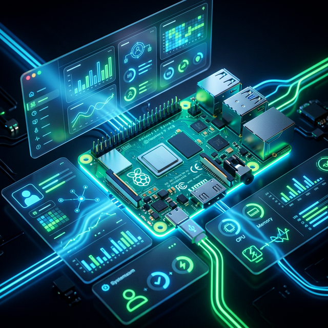

<div align="center">
   
  
  # RPi Persona Daemon
  
  <a href="https://github.com/instax-dutta/Rpi-Persona">
    
  </a>
  <a href="https://rpi.sdad.pro">
    
  </a>
  
  

  **Infrastructure with a Personality.**  
  *A minimalist, aesthetic daemon that gives your server a voice based on its health.*
</div>

---

## 🟢 Live Demo

See the daemon running live on our hardware:
[**https://rpi.sdad.pro**](https://rpi.sdad.pro)

**Hosting Hardware Specs:**
- **Device**: Raspberry Pi 3 Model B (v1.2)
- **CPU**: Quad Core 1.2GHz Broadcom BCM2837 64bit
- **RAM**: 1GB LPDDR2 (900MHz)
- **Status**: Running `persona.py` with **< 2% CPU** and **~15MB RAM** usage.

---

## 🚀 Overview

**RPi Persona** is a rule-based monitoring daemon that monitors system resources and expresses a "Mood" and "Energy" state. 

While originally **optimized for the Raspberry Pi 3 (1GB RAM)**, it scales beautifully across VPS instances and local development machines, providing a premium, "living" dashboard for your infrastructure.

### ✨ Features
- **Ultra-Lightweight**: Single-file Python script. Extremely low resource footprint.
- **Hardware Awareness**: Tracks **CPU Temperature**, **Network Latency**, and **Dominant Processes**.
- **Temporal Memory**: 60-second rolling buffer for **Trend Analysis** and **Volatility Tracking**.
- **Kinetic UI**: Reactive **SSE (Server-Sent Events)** dashboard with **GSAP Animations** (No refresh required).
- **Premium Design**: Full Glassmorphism UI with dynamic "Heartbeat" orbs that react to the system's mood.
- **AI-Ready**: Optional integration with **Ollama Cloud** to rephrase dry stats into personality-driven commentary.

---

## 📦 Installation

This daemon is designed to be "drop-in" ready.

1. **Clone the repository**
   ```bash
   git clone https://github.com/instax-dutta/Rpi-Persona.git
   cd Rpi-Persona
   ```

2. **Install minimal dependencies**
   ```bash
   pip install -r requirements.txt
   ```
   *(Only `psutil` and `flask` are required)*

---

## 🛠️ Usage

### 1. CLI Mode (Headless)
Ideal for SSH sessions or remote health checks.

```bash
python3 persona.py
```
*Output:*
```text
------------------------------
MOOD:   CALM
ENERGY: 53%
UPTIME: 1d 8h 3m 50s
------------------------------
CPU:    1.2% | MEM: 14.5% | DISK: 8.5%
------------------------------
>> System operating within tolerances.
------------------------------
```

### 2. Web Dashboard (Command Center)
Starts a sleek, real-time dashboard at `http://localhost:51987`.

```bash
python3 persona.py --web
```

---

## 🤖 AI Integration (Ollama)

By default, the daemon uses hardcoded "Base Messages". You can give it a brain by connecting it to an LLM via **Ollama Cloud**.

1. **Get an API Key** from your Ollama provider.
2. **Set the Environment Variable**:
   ```bash
   export OLLAMA_API_KEY="your_key_here"
   ```
3. **Run**: The daemon will automatically detect the key and rephrase its status messages dynamically while maintaining its "Dry, Technical, Restrained" tone.

---

## ⚙️ Customization (Fine-Tuning)

You can fine-tune the thresholds for moods (including thermal limits) by editing the `THRESHOLDS` dictionary:

```python
THRESHOLDS = {
    "irritated": {"disk": 90, "memory": 90, "temp": 80},
    "stressed":  {"memory": 80, "cpu": 85, "temp": 70},
    "alert":     {"cpu": 70, "memory": 65, "temp": 60},
    ...
}
```

---

## 🧩 Architecture

- **Reactive Core**: Uses **SSE** for high-frequency updates without the overhead of WebSockets.
- **Hardware Sensors**: Direct reads from `/sys/class/thermal` for near-zero CPU temperature overhead.
- **Trend Memory**: Implemented via `collections.deque` for memory-efficient history tracking.
- **Async-Lite**: Non-blocking resource sampling ensures the UI remains responsive on single-core setups.

## 📄 License

MIT License. Open source and free to use, modify, and host.
